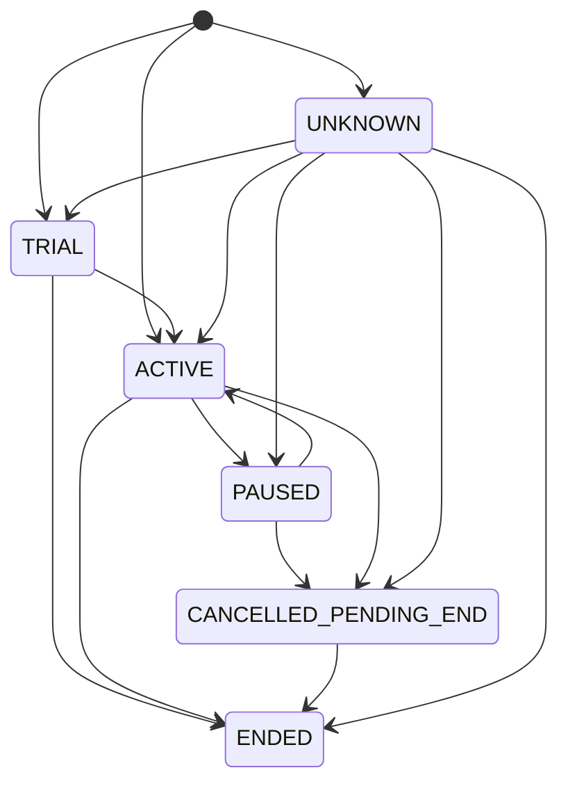
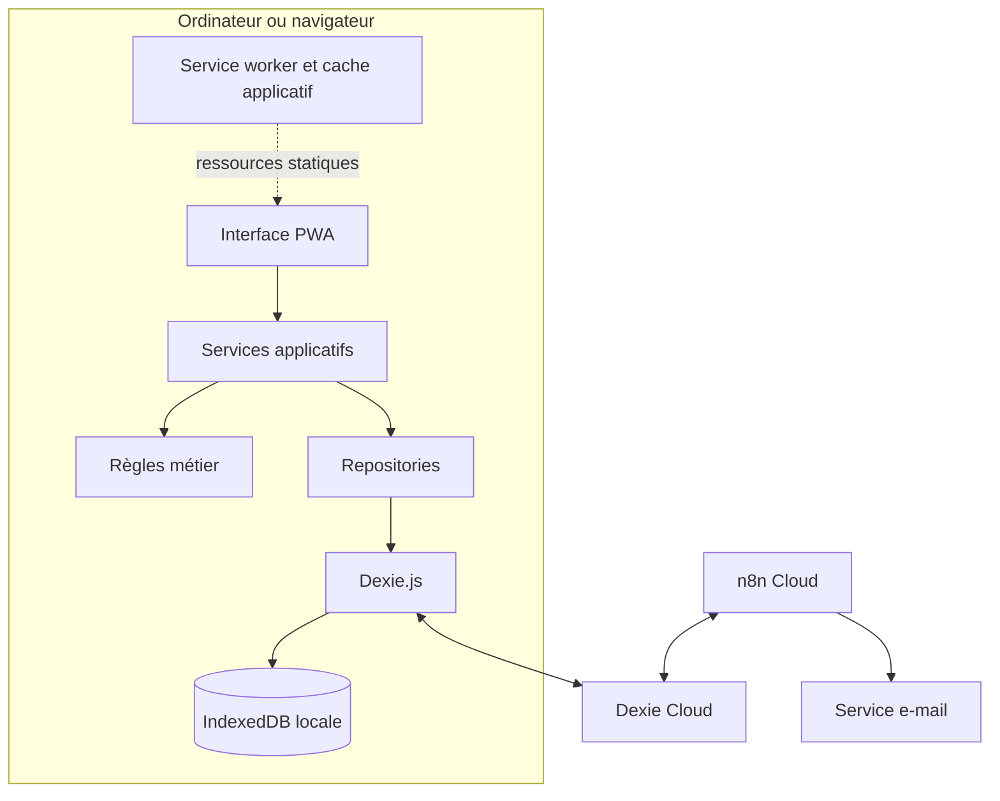
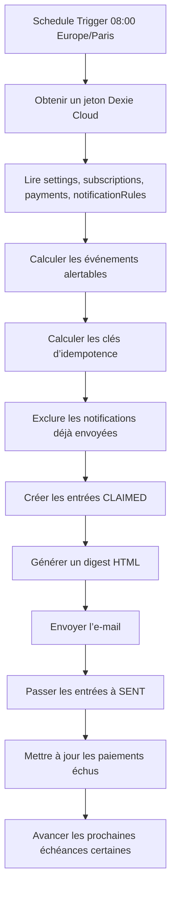

# Spécification métier, fonctionnelle et technique
## Application personnelle de gestion des souscriptions et abonnements

**Statut du document :** version de cadrage initiale prête pour implémentation  
**Public cible :** développeur humain, architecte logiciel, agent de coding  
**Architecture cible :** Static Web App, PWA, browser-only, local-first, IndexedDB, Dexie.js, Dexie Cloud, n8n pour les traitements planifiés  
**Nom de travail :** `Gestion des abonnements`  
**Nom court PWA proposé :** `Abos`  
**Fuseau horaire de référence :** `Europe/Paris`  
**Devise de consolidation par défaut :** `EUR`

---

# 1. Objet du document

Le présent document définit le contexte, les objectifs, les règles métier, les fonctionnalités, les données, l’architecture, les exigences de sécurité, les workflows d’automatisation et les critères d’acceptation d’une application personnelle de gestion des souscriptions et abonnements.

L’application est destinée à un utilisateur unique qui souhaite :

- centraliser tous ses abonnements ;
- connaître leur coût mensuel et annuel ;
- suivre les décaissements prévus ;
- mesurer les dépenses déjà réalisées ;
- anticiper les renouvellements automatiques ;
- surveiller les fins de pause, d’essai et de promotion ;
- accéder rapidement aux procédures de gestion et d’annulation ;
- retrouver les mêmes données fraîches sur plusieurs ordinateurs ;
- continuer à travailler hors connexion ;
- recevoir des alertes même lorsqu’aucun navigateur n’est ouvert.

Le document est suffisamment précis pour servir de référence à une implémentation humaine ou à un agent de coding. Les paramètres purement opérationnels encore inconnus sont regroupés dans une section dédiée et ne remettent pas en cause l’architecture.

---

# 2. Contexte et problématique

## 2.1 Situation actuelle

Les informations sont actuellement gérées dans un fichier tableur contenant une liste d’abonnements avec notamment les colonnes suivantes :

- nom ;
- catégorie ;
- période de facturation ;
- cycle en mois ;
- prix ;
- devise ;
- date de début ;
- prochaine échéance ;
- renouvellement automatique ;
- statut ;
- URL de gestion ;
- procédure d’annulation ;
- commentaire.

Le fichier constitue un bon prototype métier, mais son modèle est trop simple pour représenter correctement certains cas réels :

- abonnement annuel facturé mensuellement ;
- abonnement mis en pause avec reprise automatique ;
- abonnement annulé mais encore utilisable ;
- période gratuite ou promotionnelle ;
- date limite d’annulation distincte de la date de renouvellement ;
- prix modifié au cours du temps ;
- paiement prévu, supposé payé, confirmé ou remboursé ;
- dépenses historiques exactes sur une période.

L’audit initial du fichier fait apparaître 37 abonnements, dont une partie importante reste incomplète :

- 18 abonnements sans prix ou devise complète ;
- 19 sans prochaine échéance ;
- 33 sans URL de gestion ;
- 35 sans procédure d’annulation structurée ;
- seulement deux statuts utilisés, `Actif` et `Annulé`.

Plusieurs informations structurantes sont actuellement présentes uniquement dans les commentaires. Le futur modèle devra les convertir en données explicites, requêtables et alertables.

## 2.2 Première contrainte architecturale : plusieurs ordinateurs

Une application uniquement stockée dans l’IndexedDB d’un navigateur ne permet pas, à elle seule, de retrouver automatiquement les mêmes données sur plusieurs ordinateurs.

La solution retenue est une architecture local-first :

- IndexedDB est la base locale principale de chaque navigateur ;
- Dexie.js est la couche d’accès unique à IndexedDB ;
- l’interface lit et écrit d’abord dans la base locale ;
- Dexie Cloud synchronise les données entre les appareils ;
- l’utilisateur s’authentifie avec la même identité sur chaque appareil ;
- les opérations locales restent disponibles hors connexion ;
- la synchronisation est asynchrone et ne bloque pas l’interface.

## 2.3 Deuxième contrainte architecturale : alertes hors navigateur

Une PWA browser-only ne peut pas garantir l’exécution d’un traitement quotidien lorsque tous les navigateurs sont fermés.

La solution retenue sépare les responsabilités :

- la PWA gère l’expérience utilisateur et la donnée locale ;
- Dexie Cloud assure l’authentification, la réplication et l’accès distant sécurisé ;
- n8n exécute les traitements planifiés ;
- n8n lit les données nécessaires dans Dexie Cloud par une API serveur sécurisée ;
- n8n envoie les notifications et journalise les envois ;
- aucun cron local n’est installé sur les ordinateurs.

## 2.4 Définition de « sans backend »

Le projet ne développe aucun backend applicatif personnalisé.

Il n’existe pas :

- d’API métier Node.js, Java, .NET, Python ou équivalente ;
- de serveur de rendu obligatoire ;
- de base SQL administrée par le projet ;
- de fonction serverless métier propre à l’application.

Dexie Cloud et n8n restent néanmoins des composants distants indispensables :

- Dexie Cloud pour l’identité et la synchronisation ;
- n8n pour les traitements planifiés et les notifications.

L’architecture est donc qualifiée de **backendless avec automatisation externe**, et non de système totalement dépourvu de composants distants.

---

# 3. Décisions de cadrage validées

| Sujet | Décision |
|---|---|
| Stockage local | IndexedDB |
| Couche d’accès | Dexie.js |
| Synchronisation | Dexie Cloud avec `dexie-cloud-addon` |
| Backend applicatif personnalisé | Aucun |
| Mode d’utilisation | Browser-only et PWA |
| Fonctionnement hors ligne | Consultation et modification hors ligne |
| Nombre d’utilisateurs | Un utilisateur personnel |
| Nombre d’appareils | Plusieurs, avec au moins trois ordinateurs |
| Vérité des dépenses | Charges générées automatiquement et réputées payées, avec correction possible |
| Chiffrement applicatif des données | Non prévu dans le MVP |
| Devise de consolidation | EUR par défaut |
| Fuseau horaire | Europe/Paris |
| Alertes initiales | E-mail |
| Ordonnancement | n8n cloud |
| Cron local | Interdit |
| Partage de données | Hors périmètre |
| Intégration bancaire | Hors périmètre du MVP |

---

# 4. Vision produit

## 4.1 Proposition de valeur

L’application doit permettre de comprendre la situation financière et contractuelle de tous les abonnements en quelques secondes, puis de prendre une décision avant qu’un renouvellement non désiré ne soit exécuté.

La priorité métier est :

> Éviter les renouvellements involontaires tout en conservant une vision fiable des coûts et dépenses.

## 4.2 Objectifs métier

### OBJ-MET-001 : vision consolidée

L’utilisateur doit connaître :

- le coût mensuel équivalent ;
- le coût annuel équivalent ;
- les décaissements prévus ;
- les dépenses constatées ou supposées ;
- les montants par devise et en devise de consolidation.

### OBJ-MET-002 : anticipation

L’utilisateur doit visualiser les événements à venir :

- prélèvement ;
- renouvellement contractuel ;
- date limite d’annulation ;
- fin d’essai ;
- fin de promotion ;
- fin de pause ;
- reprise automatique ;
- fin de service après résiliation.

### OBJ-MET-003 : action rapide

Chaque abonnement doit fournir, lorsque les informations sont disponibles :

- un lien de gestion ;
- un lien d’annulation ;
- une procédure d’annulation ;
- un délai de préavis ;
- un commentaire utile à la décision.

### OBJ-MET-004 : maîtrise des données

L’utilisateur doit pouvoir :

- importer ses données initiales ;
- exporter toutes ses données ;
- restaurer un export ;
- purger les données locales d’un appareil ;
- archiver un abonnement sans perdre son historique.

### OBJ-MET-005 : continuité multi-appareils

Les données saisies sur un appareil doivent être retrouvées sur les autres appareils après synchronisation avec Dexie Cloud.

### OBJ-MET-006 : fonctionnement déconnecté

Après une première installation et authentification réussies, les fonctionnalités métier locales doivent rester utilisables sans réseau.

---

# 5. Périmètre fonctionnel

## 5.1 Périmètre du MVP

Le MVP comprend :

1. authentification Dexie Cloud ;
2. synchronisation multi-appareils ;
3. installation PWA ;
4. démarrage et CRUD hors connexion ;
5. import initial du fichier Excel ;
6. gestion des abonnements ;
7. gestion des statuts et événements de cycle de vie ;
8. gestion des paiements prévus et réalisés ;
9. tableau de bord financier ;
10. vue des prochaines échéances ;
11. alertes par e-mail ;
12. journal des notifications ;
13. export et restauration ;
14. diagnostic local, PWA et synchronisation ;
15. sauvegarde manuelle portable.

## 5.2 Hors périmètre du MVP

Sont explicitement exclus :

- connexion automatique à une banque ;
- import PSD2 ou Open Banking ;
- lecture automatique des relevés bancaires ;
- détection d’abonnements dans Gmail ou Outlook ;
- extraction automatique depuis des factures ;
- application mobile native ;
- collaboration multi-utilisateurs ;
- partage d’un abonnement avec un tiers ;
- gestion budgétaire générale hors abonnements ;
- recommandations commerciales ;
- négociation automatisée ;
- Slack, Teams et WhatsApp comme canaux de notification ;
- chiffrement applicatif de bout en bout ;
- backend métier personnalisé.

Le modèle de notification doit néanmoins permettre l’ajout ultérieur de nouveaux canaux.

---

# 6. Utilisateur et droits

## 6.1 Persona unique

**Rôle :** propriétaire de l’application et des données.

L’utilisateur peut :

- consulter toutes ses données ;
- créer, modifier, archiver et supprimer logiquement des données ;
- configurer les alertes ;
- importer et exporter ;
- se connecter sur plusieurs appareils ;
- purger la copie locale d’un appareil.

## 6.2 Modèle d’accès

- authentification obligatoire ;
- mode personnel mono-utilisateur ;
- données privées ;
- aucun partage ;
- aucun rôle collaboratif ;
- aucune donnée publique ;
- aucune inscription anonyme.

Le mode d’authentification recommandé pour le MVP est l’OTP par e-mail proposé par Dexie Cloud. Un fournisseur OAuth pourra être configuré ultérieurement sans modifier le modèle métier.

---

# 7. Concepts métier

## 7.1 Abonnement

Un abonnement représente une relation contractuelle ou commerciale récurrente donnant accès à un service.

Il possède :

- une identité ;
- un fournisseur ;
- une catégorie ;
- un statut ;
- une formule ;
- un prix courant ;
- une devise ;
- une fréquence de facturation ;
- une éventuelle durée d’engagement ;
- des dates de cycle de vie ;
- des informations de renouvellement ;
- des informations de gestion et d’annulation ;
- des règles de notification ;
- un historique de paiements.

## 7.2 Facturation et engagement

La fréquence de facturation et la durée d’engagement sont deux notions distinctes.

Exemple :

- engagement annuel ;
- facturation mensuelle de 15,00 USD.

Le modèle doit donc séparer :

- `billingInterval` : périodicité des prélèvements ;
- `commitmentInterval` : durée de la formule ou de l’engagement ;
- `renewalInterval` : périodicité du renouvellement contractuel, si elle diffère.

## 7.3 Paiement

Un paiement représente une échéance financière prévue ou passée.

Un paiement peut être :

- prévu ;
- réputé payé automatiquement ;
- confirmé manuellement ;
- ignoré ;
- remboursé ;
- corrigé.

## 7.4 Événement contractuel

Un événement contractuel est une date qui peut nécessiter une action :

- prochaine facturation ;
- renouvellement ;
- date limite d’annulation ;
- fin d’essai ;
- fin de promotion ;
- fin de pause ;
- reprise automatique ;
- fin effective du service.

## 7.5 Notification

Une notification est un message envoyé pour un événement donné, selon une fenêtre d’anticipation configurée.

Chaque envoi possède une clé d’idempotence afin de réduire le risque de doublon.

---

# 8. Cycle de vie d’un abonnement

## 8.1 Statuts

Les valeurs suivantes sont obligatoires :

| Code | Libellé | Signification |
|---|---|---|
| `TRIAL` | Essai ou promotion | Service actif, paiement absent ou tarif temporaire |
| `ACTIVE` | Actif | Service actif et normalement facturé |
| `PAUSED` | En pause | Service temporairement suspendu, sans paiement attendu pendant la pause |
| `CANCELLED_PENDING_END` | Résilié, encore utilisable | Résiliation demandée, accès maintenu jusqu’à une date future |
| `ENDED` | Terminé | Service et facturation terminés |
| `UNKNOWN` | À qualifier | Donnée importée dont l’état doit être vérifié |

## 8.2 Transitions autorisées



## 8.3 Règles de statut

### RG-STA-001

Un abonnement `PAUSED` doit posséder, si elle est connue, une date `pauseUntil`.

### RG-STA-002

Un abonnement `CANCELLED_PENDING_END` doit posséder une date `serviceEndDate` lorsqu’elle est connue.

### RG-STA-003

Un abonnement `ENDED` ne doit générer aucune nouvelle charge après sa date de fin.

### RG-STA-004

Un abonnement `TRIAL` doit posséder une date `trialEndDate` ou `promotionEndDate` lorsqu’elle est connue.

### RG-STA-005

La résiliation n’entraîne pas la suppression de l’abonnement ni de son historique.

### RG-STA-006

L’archivage est distinct du statut métier. Un abonnement terminé peut rester visible dans les analyses historiques sans apparaître par défaut dans la liste active.

---

# 9. Règles financières

## 9.1 Représentation monétaire

Tous les montants persistés doivent être stockés en unité monétaire minimale entière.

Exemple :

```typescript
const price = {
  amountMinor: 1720,
  currency: 'EUR',
};
```

La valeur représente 17,20 EUR.

Les nombres flottants JavaScript ne doivent pas être utilisés comme représentation persistée d’un montant.

## 9.2 Indicateurs obligatoires

### 9.2.1 Coût mensuel équivalent

Le coût mensuel équivalent normalise le prix récurrent sur un mois.

Exemples :

- 12,00 EUR par mois = 12,00 EUR par mois ;
- 120,00 EUR par an = 10,00 EUR par mois ;
- 30,00 EUR par trimestre = 10,00 EUR par mois.

Formule de référence :

```text
coût mensuel équivalent = montant / nombre de mois de la période de facturation
```

### 9.2.2 Coût annuel équivalent

Le coût annuel équivalent projette le tarif récurrent sur douze mois.

```text
coût annuel équivalent = coût mensuel équivalent × 12
```

### 9.2.3 Décaissements prévus

Les décaissements prévus correspondent aux charges dont la date d’échéance se situe dans une période future choisie.

Un abonnement annuel de 120,00 EUR renouvelé la semaine prochaine produit :

- un coût mensuel équivalent de 10,00 EUR ;
- un décaissement prévu de 120,00 EUR la semaine prochaine.

### 9.2.4 Dépenses sur une période

Les dépenses d’une période correspondent à la somme des paiements dont le statut est :

- `ASSUMED_PAID` ;
- `CONFIRMED_PAID` ;
- diminuée des remboursements `REFUNDED`.

Les paiements `PROJECTED` ne comptent pas comme déjà dépensés.

## 9.3 Stratégie de vérité des paiements

La décision validée est la stratégie suivante :

1. l’application ou n8n génère une charge prévisionnelle ;
2. à l’échéance, la charge devient automatiquement `ASSUMED_PAID` ;
3. l’utilisateur peut ensuite :
   - confirmer le paiement ;
   - modifier le montant ;
   - modifier la date ;
   - indiquer qu’aucun prélèvement n’a eu lieu ;
   - enregistrer un remboursement ;
4. toute correction est conservée dans l’historique.

L’interface doit toujours différencier visuellement :

- prévision ;
- paiement supposé ;
- paiement confirmé.

## 9.4 Devises

### RG-FX-001

Le montant d’origine et sa devise doivent toujours être conservés.

### RG-FX-002

La devise de consolidation par défaut est l’EUR.

### RG-FX-003

Une conversion utilisée dans un historique de paiement doit enregistrer :

- le taux ;
- la date du taux ;
- la source ;
- le montant converti.

### RG-FX-004

En l’absence de taux disponible, le montant doit rester visible dans sa devise d’origine et être exclu du total consolidé avec un avertissement explicite.

### RG-FX-005

Le MVP peut autoriser un taux saisi manuellement. L’actualisation automatique des taux est une amélioration optionnelle exécutée par n8n.

## 9.5 Calcul des prochaines dates

### RG-DAT-001

La prochaine date d’échéance doit être persistée explicitement. Elle ne doit pas être déduite uniquement de la date de début à chaque affichage.

### RG-DAT-002

Après validation ou présomption d’un paiement récurrent, la prochaine échéance est avancée selon la fréquence de facturation.

### RG-DAT-003

Pour une échéance située le 29, 30 ou 31, si le mois cible ne contient pas ce jour, la date retenue est le dernier jour valide du mois cible.

### RG-DAT-004

Lorsqu’un abonnement suit une logique de fin de mois, cette logique doit être conservée lors des échéances suivantes.

### RG-DAT-005

L’utilisateur peut toujours corriger manuellement une prochaine date calculée.

### RG-DAT-006

Toutes les dates contractuelles sans heure sont stockées comme dates civiles `YYYY-MM-DD` afin d’éviter les décalages de fuseau horaire.

---

# 10. Règles de renouvellement, pause et annulation

## 10.1 Renouvellement automatique

Le renouvellement utilise un type à trois états :

- `AUTOMATIC` ;
- `MANUAL` ;
- `UNKNOWN`.

Un booléen simple est insuffisant pour les données importées non vérifiées.

### RG-REN-001

Un abonnement à renouvellement automatique doit être mis en évidence dans toutes les vues d’échéances.

### RG-REN-002

La date limite d’annulation doit être stockée explicitement lorsqu’elle est connue.

### RG-REN-003

Si seule une durée de préavis est connue, la date limite d’annulation peut être calculée :

```text
date limite d’annulation = date de renouvellement - délai de préavis
```

### RG-REN-004

Une date calculée doit être distinguée d’une date confirmée par le fournisseur.

## 10.2 Pause

### RG-PAU-001

Pendant une pause, aucune charge récurrente ne doit être générée entre `pauseStartDate` et `pauseUntil`, sauf exception saisie manuellement.

### RG-PAU-002

La reprise automatique doit générer un événement alertable.

### RG-PAU-003

À la fin d’une pause, le statut ne doit pas être modifié silencieusement si la date de reprise ou la prochaine facturation est ambiguë. n8n peut signaler l’action à réaliser, tandis que la transition automatique n’est exécutée que si la règle est certaine.

## 10.3 Essai et promotion

### RG-TRI-001

Une fin d’essai doit être alertée avant le premier paiement.

### RG-TRI-002

Le tarif promotionnel et le tarif normal doivent pouvoir être représentés séparément.

### RG-TRI-003

La date du premier paiement normal doit être explicitement visible.

## 10.4 Annulation

### RG-CAN-001

Une demande d’annulation doit enregistrer :

- la date de demande ;
- la date de fin effective ;
- le canal ou la procédure utilisée ;
- un commentaire ;
- une preuve ou référence facultative.

### RG-CAN-002

Après annulation, aucune charge ne doit être générée au-delà de la date de fin effective.

### RG-CAN-003

Un abonnement annulé mais encore utilisable reste dans le statut `CANCELLED_PENDING_END` jusqu’à sa date de fin.

---

# 11. Fonctionnalités détaillées

## 11.1 Authentification

### FUN-AUTH-001

L’application doit exiger une authentification Dexie Cloud pour accéder aux données synchronisées.

### FUN-AUTH-002

L’application doit fournir :

- connexion ;
- déconnexion ;
- identité du compte connecté ;
- affichage des erreurs d’authentification ;
- purge locale de l’appareil.

### FUN-AUTH-003

Déconnexion et purge locale sont deux actions distinctes.

### FUN-AUTH-004

La purge locale ne doit pas supprimer la copie distante.

## 11.2 Tableau de bord

Le tableau de bord doit afficher au minimum :

- coût mensuel équivalent ;
- coût annuel équivalent ;
- dépenses depuis le 1er janvier ;
- dépenses sur les douze derniers mois ;
- décaissements prévus à 30 jours ;
- décaissements prévus à 90 jours ;
- nombre d’abonnements actifs ;
- nombre d’abonnements en pause ;
- nombre d’abonnements à compléter ;
- prochaines échéances importantes ;
- répartition des coûts par catégorie ;
- répartition des coûts par devise ;
- alertes nécessitant une action.

Le tableau de bord doit permettre de distinguer :

- montant d’origine ;
- montant consolidé ;
- paiement prévu ;
- paiement supposé ;
- paiement confirmé.

## 11.3 Liste des abonnements

La liste doit permettre :

- recherche par nom ou fournisseur ;
- filtre par statut ;
- filtre par catégorie ;
- filtre par devise ;
- filtre par renouvellement automatique ;
- filtre par complétude ;
- tri par prochaine échéance ;
- tri par coût mensuel ;
- tri par coût annuel ;
- tri par date de modification ;
- affichage compact ou détaillé ;
- archivage ;
- accès rapide à la gestion et à l’annulation.

## 11.4 Fiche abonnement

La fiche doit être organisée en sections :

1. identité ;
2. tarification ;
3. facturation ;
4. engagement et renouvellement ;
5. cycle de vie ;
6. gestion et annulation ;
7. alertes ;
8. commentaires ;
9. paiements ;
10. historique des modifications.

## 11.5 Création et modification

### FUN-CRUD-001

Une création ou modification est considérée comme réussie dès que la transaction locale IndexedDB est validée.

### FUN-CRUD-002

L’interface ne doit pas attendre la confirmation de Dexie Cloud pour fermer un formulaire après une écriture locale réussie.

### FUN-CRUD-003

Le retour utilisateur doit distinguer :

- enregistré sur cet appareil ;
- en attente de synchronisation ;
- synchronisé ;
- échec local ;
- échec de synchronisation.

### FUN-CRUD-004

Une erreur de synchronisation ne doit pas être présentée comme une perte de la donnée locale.

## 11.6 Vue des échéances

La vue doit proposer :

- calendrier ;
- liste chronologique ;
- regroupement par semaine ou mois ;
- filtre par type d’événement ;
- filtre par renouvellement automatique ;
- horizon 7, 30, 60, 90, 365 jours ;
- affichage des montants ;
- action directe de gestion ou annulation.

## 11.7 Historique des dépenses

L’utilisateur doit pouvoir analyser :

- année civile ;
- douze derniers mois ;
- période personnalisée ;
- catégorie ;
- abonnement ;
- devise ;
- statut de paiement.

L’utilisateur doit pouvoir corriger un paiement supposé sans modifier rétroactivement le tarif courant de l’abonnement.

## 11.8 Complétude des données

Chaque abonnement doit recevoir un indicateur de complétude.

Champs critiques :

- nom ;
- statut ;
- prix ;
- devise ;
- fréquence de facturation ;
- prochaine échéance ;
- type de renouvellement.

Champs recommandés :

- catégorie ;
- URL de gestion ;
- URL d’annulation ;
- procédure d’annulation ;
- date limite d’annulation ;
- commentaire.

L’interface doit proposer une vue « À compléter ».

## 11.9 Import et export

### FUN-PORT-001

Les formats d’import du MVP sont :

- XLSX selon le modèle existant ;
- CSV documenté ;
- JSON natif de sauvegarde.

### FUN-PORT-002

Les formats d’export sont :

- JSON complet et restaurable ;
- CSV des abonnements ;
- CSV des paiements.

### FUN-PORT-003

L’import doit proposer une simulation avant validation.

### FUN-PORT-004

Les stratégies d’import sont :

- créer uniquement ;
- fusionner par identifiant ;
- fusionner par nom après validation manuelle ;
- remplacer les données locales et synchronisées après confirmation renforcée.

### FUN-PORT-005

Toute importation multi-table doit être transactionnelle.

## 11.10 Diagnostic

Une vue de diagnostic doit afficher :

- version applicative ;
- version du schéma ;
- nom de la base locale ;
- identité connectée ;
- statut réseau ;
- statut Dexie Cloud ;
- date de dernière synchronisation ;
- statut du service worker ;
- stockage persistant accordé ou non ;
- quota estimé ;
- volume utilisé estimé ;
- nombre d’éléments en attente de synchronisation, lorsque disponible.

---

# 12. Écrans et navigation

## 12.1 Routes recommandées

| Route | Écran |
|---|---|
| `/` | Tableau de bord |
| `/subscriptions` | Liste des abonnements |
| `/subscriptions/new` | Création |
| `/subscriptions/:id` | Fiche abonnement |
| `/upcoming` | Échéances à venir |
| `/expenses` | Dépenses et paiements |
| `/notifications` | Règles et historique des alertes |
| `/data` | Import, export et sauvegarde |
| `/settings` | Paramètres |
| `/diagnostics` | Diagnostic technique |

Un routage par hash peut être retenu si l’hébergement statique ne supporte pas la réécriture vers `index.html`.

## 12.2 États d’interface obligatoires

Chaque écran de données doit gérer :

- initialisation ;
- chargement local ;
- synchronisation initiale ;
- données disponibles ;
- liste vide ;
- hors connexion ;
- synchronisation en cours ;
- erreur de synchronisation ;
- erreur locale ;
- migration en cours ;
- absence d’autorisation.

## 12.3 Indicateur global

L’en-tête doit afficher un indicateur compréhensible :

- Données synchronisées ;
- Modifications enregistrées sur cet appareil ;
- Synchronisation en cours ;
- Hors connexion ;
- Synchronisation impossible.

Une action « Synchroniser maintenant » doit être disponible sans être nécessaire au fonctionnement normal.

---

# 13. Modèle de données

## 13.1 Conventions communes

Toutes les entités synchronisées doivent utiliser une clé globalement unique, jamais une clé auto-incrémentée `++id`.

```typescript
interface SyncedEntity {
  id: string;
  createdAt: Date;
  updatedAt: Date;
  deletedAt?: Date;
  schemaVersion: number;
  revision?: number;
}

type LocalDate = `${number}-${number}-${number}`;

type CurrencyCode = string;

interface Money {
  amountMinor: number;
  currency: CurrencyCode;
}
```

## 13.2 Table `subscriptions`

```typescript
type SubscriptionStatus =
  | 'TRIAL'
  | 'ACTIVE'
  | 'PAUSED'
  | 'CANCELLED_PENDING_END'
  | 'ENDED'
  | 'UNKNOWN';

type RenewalMode = 'AUTOMATIC' | 'MANUAL' | 'UNKNOWN';

type IntervalUnit = 'DAY' | 'WEEK' | 'MONTH' | 'YEAR';

type DateSource = 'CONFIRMED' | 'CALCULATED' | 'IMPORTED' | 'UNKNOWN';

interface Subscription extends SyncedEntity {
  name: string;
  provider?: string;
  planName?: string;
  categoryId?: string;
  status: SubscriptionStatus;
  archivedAt?: Date;

  currentPrice?: Money;

  billingIntervalUnit?: IntervalUnit;
  billingIntervalCount?: number;

  commitmentIntervalUnit?: IntervalUnit;
  commitmentIntervalCount?: number;

  renewalIntervalUnit?: IntervalUnit;
  renewalIntervalCount?: number;
  renewalMode: RenewalMode;

  startDate?: LocalDate;
  nextChargeDate?: LocalDate;
  nextChargeDateSource?: DateSource;
  nextRenewalDate?: LocalDate;
  nextRenewalDateSource?: DateSource;
  cancellationDeadline?: LocalDate;
  cancellationDeadlineSource?: DateSource;

  trialEndDate?: LocalDate;
  promotionEndDate?: LocalDate;
  pauseStartDate?: LocalDate;
  pauseUntil?: LocalDate;
  cancellationRequestedAt?: LocalDate;
  serviceEndDate?: LocalDate;

  cancellationNoticeDays?: number;
  managementUrl?: string;
  cancellationUrl?: string;
  cancellationInstructions?: string;
  notes?: string;

  dataQualityFlags?: string[];
}
```

## 13.3 Table `categories`

```typescript
interface Category extends SyncedEntity {
  name: string;
  sortOrder?: number;
  icon?: string;
}
```

Les catégories initiales proposées sont :

- IA ;
- Productivité ;
- Graphisme ;
- Streaming vidéo ou musique ;
- Musique ;
- Sécurité ;
- Développement ;
- Hébergement ;
- E-learning ;
- Média et newsletter ;
- Communauté ;
- Shopping ;
- Loisirs ;
- Autre.

## 13.4 Table `payments`

```typescript
type PaymentStatus =
  | 'PROJECTED'
  | 'ASSUMED_PAID'
  | 'CONFIRMED_PAID'
  | 'SKIPPED'
  | 'REFUNDED';

type PaymentSource =
  | 'GENERATED'
  | 'IMPORTED'
  | 'MANUAL'
  | 'N8N';

interface Payment extends SyncedEntity {
  subscriptionId: string;
  scheduledDate: LocalDate;
  paidDate?: LocalDate;
  status: PaymentStatus;

  amount: Money;
  baseCurrency?: CurrencyCode;
  baseAmountMinor?: number;
  fxRate?: number;
  fxRateDate?: LocalDate;
  fxSource?: string;

  source: PaymentSource;
  externalReference?: string;
  notes?: string;
  correctedAt?: Date;
}
```

## 13.5 Table `notificationRules`

```typescript
type NotificationEventType =
  | 'CHARGE_DUE'
  | 'RENEWAL_DUE'
  | 'CANCELLATION_DEADLINE'
  | 'TRIAL_END'
  | 'PROMOTION_END'
  | 'PAUSE_END'
  | 'SERVICE_END';

type NotificationChannel = 'EMAIL' | 'SLACK' | 'TEAMS' | 'WHATSAPP';

interface NotificationRule extends SyncedEntity {
  subscriptionId?: string;
  eventType: NotificationEventType;
  enabled: boolean;
  leadTimesDays: number[];
  channels: NotificationChannel[];
}
```

Une règle sans `subscriptionId` est une règle globale. Une règle liée à un abonnement surcharge la règle globale pour cet abonnement et ce type d’événement.

## 13.6 Table `notificationDeliveries`

```typescript
type DeliveryStatus =
  | 'CLAIMED'
  | 'SENT'
  | 'FAILED'
  | 'SKIPPED';

interface NotificationDelivery extends SyncedEntity {
  idempotencyKey: string;
  subscriptionId: string;
  eventType: NotificationEventType;
  eventDate: LocalDate;
  leadTimeDays: number;
  channel: NotificationChannel;
  recipient: string;
  status: DeliveryStatus;
  claimedAt?: Date;
  sentAt?: Date;
  providerMessageId?: string;
  attemptCount: number;
  lastErrorCode?: string;
}
```

## 13.7 Table `settings`

```typescript
interface AppSettings extends SyncedEntity {
  key: 'main';
  baseCurrency: CurrencyCode;
  timezone: string;
  notificationEmail?: string;
  defaultAnnualLeadTimesDays: number[];
  defaultMonthlyLeadTimesDays: number[];
  defaultTrialLeadTimesDays: number[];
  defaultPauseLeadTimesDays: number[];
  paymentAssumptionEnabled: boolean;
  paymentAssumptionDelayDays: number;
  notificationDigestEnabled: boolean;
}
```

## 13.8 Table `fxRates`

```typescript
interface FxRate extends SyncedEntity {
  rateDate: LocalDate;
  baseCurrency: CurrencyCode;
  quoteCurrency: CurrencyCode;
  rate: number;
  source: string;
}
```

## 13.9 Table `auditEvents`

```typescript
type AuditEventType =
  | 'SUBSCRIPTION_CREATED'
  | 'SUBSCRIPTION_UPDATED'
  | 'STATUS_CHANGED'
  | 'PRICE_CHANGED'
  | 'PAYMENT_CORRECTED'
  | 'IMPORT_COMPLETED'
  | 'RESTORE_COMPLETED';

interface AuditEvent extends SyncedEntity {
  eventType: AuditEventType;
  entityType: string;
  entityId: string;
  occurredAt: Date;
  summary: string;
  changedFields?: string[];
}
```

Les événements d’audit ne doivent pas stocker une copie intégrale des données sensibles.

## 13.10 Tables locales uniquement

Les tables suivantes ne sont pas synchronisées :

- `localSettings` ;
- `drafts` ;
- `importPreview` ;
- `diagnosticLogs` ;
- `externalCache`.

Exemples de préférences locales :

- mode compact ;
- dernier filtre utilisé ;
- appareil de confiance ;
- brouillon non validé ;
- cache temporaire de taux régénérables.

---

# 14. Schéma Dexie de référence

```typescript
import Dexie from 'dexie';
import dexieCloud, { type DexieCloudTable } from 'dexie-cloud-addon';

export class SubscriptionDatabase extends Dexie {
  subscriptions!: DexieCloudTable<Subscription, 'id'>;
  categories!: DexieCloudTable<Category, 'id'>;
  payments!: DexieCloudTable<Payment, 'id'>;
  notificationRules!: DexieCloudTable<NotificationRule, 'id'>;
  notificationDeliveries!: DexieCloudTable<NotificationDelivery, 'id'>;
  settings!: DexieCloudTable<AppSettings, 'id'>;
  fxRates!: DexieCloudTable<FxRate, 'id'>;
  auditEvents!: DexieCloudTable<AuditEvent, 'id'>;

  localSettings!: Dexie.Table<LocalSetting, string>;
  drafts!: Dexie.Table<Draft, string>;
  importPreview!: Dexie.Table<ImportPreviewRow, string>;
  diagnosticLogs!: Dexie.Table<DiagnosticLog, string>;
  externalCache!: Dexie.Table<ExternalCacheEntry, string>;

  constructor() {
    super('subscription-manager-db', {
      addons: [dexieCloud],
    });

    this.version(1).stores({
      subscriptions:
        '@id, status, categoryId, renewalMode, nextChargeDate, nextRenewalDate, cancellationDeadline, pauseUntil, trialEndDate, serviceEndDate, updatedAt, deletedAt',
      categories: '@id, &name, sortOrder, updatedAt, deletedAt',
      payments:
        '@id, subscriptionId, scheduledDate, paidDate, status, [subscriptionId+scheduledDate], updatedAt, deletedAt',
      notificationRules:
        '@id, subscriptionId, eventType, enabled, [subscriptionId+eventType], updatedAt, deletedAt',
      notificationDeliveries:
        '@id, &idempotencyKey, subscriptionId, eventDate, status, sentAt, updatedAt',
      settings: '@id, &key, updatedAt',
      fxRates:
        '@id, [rateDate+baseCurrency+quoteCurrency], rateDate, baseCurrency, quoteCurrency, updatedAt',
      auditEvents:
        '@id, entityType, entityId, eventType, occurredAt, updatedAt',

      localSettings: '&key',
      drafts: '&id, entityType, updatedAt',
      importPreview: '&id, rowNumber, status',
      diagnosticLogs: '++id, timestamp, category',
      externalCache: '&key, expiresAt',
    });

    this.cloud.configure({
      databaseUrl: import.meta.env.VITE_DEXIE_CLOUD_URL,
      requireAuth: true,
      tryUseServiceWorker: true,
      unsyncedTables: [
        'localSettings',
        'drafts',
        'importPreview',
        'diagnosticLogs',
        'externalCache',
      ],
    });
  }
}
```

Les index doivent être ajustés selon les requêtes réellement mesurées. Les propriétés non utilisées dans les tris ou filtres ne doivent pas être indexées sans nécessité.

---

# 15. Architecture logique



## 15.1 Responsabilités du navigateur

Le navigateur exécute :

- interface ;
- validations ;
- règles métier interactives ;
- calculs de dashboard ;
- CRUD ;
- import et export ;
- cache applicatif ;
- stockage IndexedDB ;
- synchronisation Dexie Cloud par l’addon.

## 15.2 Responsabilités de Dexie Cloud

Dexie Cloud assure :

- authentification ;
- synchronisation ;
- réplication multi-appareils ;
- contrôle d’accès ;
- copie distante ;
- accès REST sécurisé pour n8n ;
- webhooks optionnels.

## 15.3 Responsabilités de n8n

n8n assure :

- ordonnanceur quotidien ;
- lecture serveur des données alertables ;
- génération du digest ;
- envoi des e-mails ;
- journalisation des envois ;
- relance contrôlée en cas d’erreur ;
- présomption automatique des paiements échus ;
- génération ou avancement des prochaines échéances selon les règles définies ;
- actualisation facultative des taux de change ;
- sauvegarde périodique facultative vers un stockage externe.

n8n ne devient pas la source principale des données métier.

---

# 16. Architecture local-first et synchronisation

## 16.1 Principes obligatoires

### TECH-LF-001

Toutes les lectures de l’interface proviennent de Dexie.js et d’IndexedDB.

### TECH-LF-002

Toutes les écritures sont validées localement avant la synchronisation.

### TECH-LF-003

Une indisponibilité réseau ne doit pas bloquer :

- consultation ;
- création ;
- modification ;
- archivage ;
- suppression locale ;
- recherche ;
- tri ;
- filtrage ;
- calcul local ;
- export.

### TECH-LF-004

La synchronisation reste la responsabilité de `dexie-cloud-addon`.

### TECH-LF-005

Le code métier du navigateur ne doit pas appeler directement l’API REST Dexie Cloud.

### TECH-LF-006

Les vues doivent être réactives aux changements IndexedDB, par exemple avec `liveQuery()` ou l’intégration Dexie du framework.

### TECH-LF-007

L’application doit observer l’état réel de `db.cloud.syncState` et non se contenter de `navigator.onLine`.

### TECH-LF-008

Le service worker peut améliorer certaines synchronisations, mais aucune règle critique ne dépend de son exécution périodique.

## 16.2 Démarrage

L’ordre logique est :

1. charger les ressources PWA ;
2. ouvrir IndexedDB ;
3. afficher les données locales ;
4. vérifier l’identité ;
5. lancer ou poursuivre la synchronisation ;
6. afficher l’état de synchronisation ;
7. converger avec la copie distante.

Le démarrage ne doit jamais être bloqué par l’attente de la synchronisation, sauf sur un nouvel appareil qui ne possède encore aucune donnée locale.

## 16.3 Nouvel appareil

Sur un nouvel appareil :

1. l’utilisateur charge l’application en ligne ;
2. il s’authentifie ;
3. l’application affiche « Synchronisation initiale en cours » ;
4. les données sont récupérées dans IndexedDB ;
5. l’application indique lorsque la copie locale est complète ;
6. les données deviennent ensuite utilisables hors connexion.

## 16.4 Multi-onglets

Deux onglets de la même origine doivent observer la même base IndexedDB.

Une modification validée dans un onglet doit être reflétée dans l’autre sans rechargement manuel.

## 16.5 Conflits

Pour l’usage mono-utilisateur multi-appareils :

- utiliser les identifiants globaux Dexie Cloud ;
- utiliser des transactions pour les invariants multi-tables ;
- préférer les mises à jour ciblées ;
- éviter de remplacer un objet complet pour modifier une propriété ;
- accepter le modèle standard de convergence Dexie Cloud ;
- prévoir une résolution manuelle uniquement lorsqu’une perte sémantique est possible.

Exemple recommandé :

```typescript
await db.subscriptions.update(subscriptionId, {
  nextChargeDate,
  updatedAt: new Date(),
});
```

Exemple à éviter pour une modification partielle :

```typescript
await db.subscriptions.put(entireSubscriptionObject);
```

## 16.6 Transactions

Une transaction Dexie est obligatoire pour :

- création d’un abonnement avec sa première charge ;
- changement de statut avec ajustement des paiements futurs ;
- import multi-table ;
- restauration ;
- annulation avec suppression des charges futures ;
- correction impliquant paiement et audit.

---

# 17. PWA et cache applicatif

## 17.1 Séparation des stockages

- IndexedDB : données métier ;
- Cache Storage : HTML, CSS, JavaScript, icônes et ressources ;
- mémoire JavaScript : états temporaires ;
- `localStorage` : uniquement de petites préférences non sensibles si nécessaire.

## 17.2 Installation

La PWA doit fournir :

- manifeste valide ;
- icônes ;
- `display: standalone` ;
- nom et nom court ;
- couleur de thème ;
- écran de démarrage ;
- fonctionnement dans un onglet classique si non installée.

## 17.3 Cache

Stratégie recommandée :

- précache des ressources versionnées ;
- cache-first pour les fichiers avec hash ;
- network-first avec repli cache pour le document HTML principal ;
- suppression des anciens caches à l’activation ;
- aucune donnée métier dans Cache Storage.

## 17.4 Mise à jour

Lorsqu’une nouvelle version est disponible :

- téléchargement en arrière-plan ;
- notification non bloquante ;
- bouton « Mettre à jour » ;
- protection d’un formulaire non enregistré ;
- rechargement contrôlé ;
- conservation intégrale d’IndexedDB.

## 17.5 Stockage persistant

Après une action utilisateur explicite, l’application doit demander si possible un stockage persistant :

```typescript
const granted = await navigator.storage?.persist?.();
```

Le refus du navigateur ne doit pas bloquer l’application. Le diagnostic doit exposer ce statut.

---

# 18. Architecture des alertes n8n

## 18.1 Principe

Les alertes critiques ne dépendent pas du navigateur ni du service worker.

n8n exécute un workflow quotidien dans le fuseau `Europe/Paris`.

Horaire recommandé : `08:00`.

## 18.2 Accès sécurisé à Dexie Cloud

n8n utilise un client machine Dexie Cloud dédié.

Exigences :

- identifiant et secret stockés uniquement dans les credentials n8n ;
- aucun secret dans la PWA ;
- client distinct du client de développement ;
- privilèges minimaux ;
- accès au seul utilisateur personnel ;
- absence de droits globaux lorsque l’impersonation ciblée suffit ;
- rotation documentée du secret.

Configuration de privilèges recommandée :

- `ACCESS_DB` ;
- `IMPERSONATE` ;
- pas de `GLOBAL_READ` ;
- pas de `GLOBAL_WRITE`.

Le workflow obtient un jeton au nom de l’utilisateur, puis utilise les endpoints personnels `/my/...`.

## 18.3 Workflow quotidien principal



## 18.4 Fenêtres d’alerte par défaut

| Événement | Anticipations par défaut |
|---|---|
| Renouvellement annuel | J-60, J-30, J-14, J-7, J-2, J0 |
| Renouvellement mensuel | J-7, J-2, J0 |
| Date limite d’annulation | J-30, J-14, J-7, J-2, J0 |
| Fin d’essai | J-14, J-7, J-2, J0 |
| Fin de promotion | J-14, J-7, J-2, J0 |
| Fin de pause | J-14, J-7, J-2, J0 |
| Prochaine facturation annuelle | J-30, J-14, J-7, J-2, J0 |
| Prochaine facturation mensuelle | J-7, J-2, J0 |
| Fin de service | J-7, J-2, J0 |

Ces valeurs sont configurables globalement et surchargeables par abonnement.

## 18.5 Digest e-mail

Objet recommandé :

```text
Abonnements : 3 échéances à surveiller
```

Chaque ligne doit contenir :

- niveau d’urgence ;
- nom de l’abonnement ;
- type d’événement ;
- date ;
- nombre de jours restants ;
- montant et devise ;
- renouvellement automatique ou manuel ;
- lien de gestion ;
- lien d’annulation ;
- procédure courte ;
- commentaire utile.

Le digest est envoyé uniquement si au moins une alerte est pertinente, sauf option de rapport quotidien vide explicitement activée.

## 18.6 Idempotence

La clé d’idempotence est :

```text
subscriptionId:eventType:eventDate:leadTimeDays:channel:recipient
```

Avant un envoi, n8n doit vérifier l’absence d’une entrée `SENT` ou `CLAIMED` non expirée ayant cette clé.

Une entrée `CLAIMED` peut être reprise après un délai de sécurité configurable si le workflow précédent a échoué avant l’envoi.

## 18.7 Gestion des erreurs

- trois tentatives maximum pour une erreur transitoire ;
- temporisation croissante ;
- conservation du code d’erreur ;
- notification technique distincte après échec définitif ;
- aucune donnée d’authentification dans les logs ;
- aucune procédure d’annulation complète dans les logs techniques ;
- le workflow doit être idempotent après reprise.

## 18.8 Webhook Dexie Cloud optionnel

Un webhook Dexie Cloud vers n8n peut être ajouté pour :

- lancer un recalcul immédiat après modification d’une date ;
- vérifier une nouvelle règle de notification ;
- déclencher un e-mail de test ;
- invalider un cache n8n.

Le webhook ne remplace pas le workflow quotidien.

Le secret du webhook est comparé au header reçu avant tout traitement. Le endpoint n8n doit répondre rapidement, puis traiter de manière asynchrone si nécessaire.

## 18.9 Paiements échus

Chaque jour, n8n doit :

1. rechercher les paiements `PROJECTED` dont la date est passée ou égale à la date courante ;
2. les passer à `ASSUMED_PAID` lorsque l’option est active ;
3. renseigner `paidDate` avec la date prévue, sauf règle différente ;
4. générer ou mettre à jour l’échéance suivante ;
5. créer un événement d’audit ;
6. ne pas générer de paiement pendant une pause ;
7. ne pas générer de paiement après la fin du service.

## 18.10 Sauvegarde automatisée facultative

Un workflow hebdomadaire peut :

- lire les tables personnelles par l’API Dexie Cloud ;
- produire un JSON versionné ;
- chiffrer éventuellement l’archive au niveau du workflow ;
- déposer l’archive dans OneDrive, Google Drive ou un stockage objet ;
- appliquer une rétention glissante.

Cette sauvegarde ne remplace pas l’export manuel du navigateur.

---

# 19. Import du fichier Excel existant

## 19.1 Mapping initial

| Colonne Excel | Cible | Règle |
|---|---|---|
| Nom | `subscriptions.name` | Obligatoire |
| Catégorie | `categoryId` | Créer ou retrouver la catégorie |
| Période de facturation | `billingIntervalUnit` et `billingIntervalCount` | Mensuel = 1 mois, Annuel = 1 an par défaut |
| Cycle (mois) | Facturation ou engagement | Champ ambigu, à interpréter avec contrôle |
| Prix | `currentPrice.amountMinor` | Conversion en unité minimale |
| Devise | `currentPrice.currency` | Code normalisé en majuscules |
| Date de début | `startDate` | Conversion Excel vers `YYYY-MM-DD` |
| Prochaine échéance | `nextChargeDate` | Source `IMPORTED` |
| Renouvellement auto | `renewalMode` | Oui = `AUTOMATIC`, Non = `MANUAL` |
| Statut | `status` | Mapping assisté |
| URL de gestion | `managementUrl` | Validation URL |
| Procédure d’annulation | `cancellationInstructions` | Texte libre |
| Commentaire | `notes` | Conserver intégralement |

## 19.2 Gestion du champ « Cycle (mois) »

Ce champ est ambigu dans le fichier actuel.

Règles d’import proposées :

1. période `Mensuel` et cycle vide ou `1` : facturation tous les mois ;
2. période `Annuel` et cycle vide ou `12` : facturation annuelle ;
3. période `Annuel` et cycle `1` avec commentaire indiquant une facturation mensuelle :
   - engagement de 12 mois ;
   - facturation tous les mois ;
4. toute combinaison contradictoire est marquée `REVIEW_BILLING_MODEL` ;
5. l’import ne doit pas décider silencieusement d’une interprétation incertaine.

## 19.3 Mapping des statuts

| Donnée importée | Statut proposé | Contrôle |
|---|---|---|
| Actif | `ACTIVE` | Sauf indice de pause ou essai |
| Annulé avec date future de fin | `CANCELLED_PENDING_END` | Date à confirmer |
| Annulé sans accès restant | `ENDED` | À confirmer |
| Commentaire « en pause jusqu’au… » | `PAUSED` | Proposition assistée |
| Commentaire « gratuit jusqu’au… » | `TRIAL` | Proposition assistée |

## 19.4 Extraction assistée des commentaires

Le moteur d’import peut détecter des expressions comme :

- « en pause jusqu’au » ;
- « actif jusqu’au » ;
- « gratuit jusqu’au » ;
- « facturé tous les mois » ;
- « annulé le ».

Les valeurs détectées sont présentées comme suggestions. Elles ne sont validées qu’après confirmation dans l’aperçu d’import.

## 19.5 Rapport d’import

Le rapport doit indiquer :

- lignes valides ;
- lignes incomplètes ;
- lignes ambiguës ;
- doublons possibles ;
- catégories créées ;
- dates détectées ;
- statuts proposés ;
- erreurs bloquantes ;
- avertissements non bloquants.

---

# 20. Sécurité

## 20.1 Principes

### SEC-001

L’application est servie uniquement en HTTPS en production.

### SEC-002

Aucun secret ne doit être présent dans :

- dépôt ;
- bundle JavaScript ;
- manifeste ;
- service worker ;
- variables frontend ;
- logs de build.

### SEC-003

L’URL Dexie Cloud peut être publique. Le fichier `dexie-cloud.key`, les secrets clients, les jetons d’administration et les secrets n8n sont interdits dans le frontend.

### SEC-004

Les entrées utilisateur sont non fiables et doivent être validées.

### SEC-005

Le texte utilisateur ne doit pas être injecté comme HTML non nettoyé.

### SEC-006

Une Content Security Policy doit être activée lorsque l’hébergeur le permet.

### SEC-007

Les dépendances sont verrouillées et analysées régulièrement.

## 20.2 Absence de chiffrement applicatif

Le MVP ne chiffre pas les données métier avant leur stockage dans IndexedDB ou Dexie Cloud.

Conséquences à documenter :

- une personne ayant accès à une session ouverte peut consulter les données locales ;
- la sécurité de l’appareil reste essentielle ;
- la purge locale doit être disponible ;
- IndexedDB n’est pas présenté comme un coffre-fort applicatif ;
- la suppression du cache HTTP ne supprime pas IndexedDB ;
- les secrets et mots de passe de fournisseurs ne doivent jamais être stockés dans les commentaires.

## 20.3 Sécurité n8n

- credentials chiffrés et stockés dans n8n ;
- secret Dexie Cloud distinct par environnement ;
- privilèges minimaux ;
- webhooks protégés par secret de header ;
- accès n8n protégé par authentification forte ;
- sauvegarde de la configuration n8n ;
- audit de sécurité régulier ;
- mise à jour de l’instance ;
- limitation des logs métier.

## 20.4 Données personnelles

Les données peuvent révéler :

- habitudes de consommation ;
- fournisseurs utilisés ;
- montants dépensés ;
- adresse e-mail d’authentification ;
- commentaires personnels.

La durée de conservation par défaut est :

- abonnements et paiements : illimitée jusqu’à suppression explicite ;
- notifications : 24 mois, configurable ;
- logs techniques locaux : 30 jours maximum ;
- brouillons : jusqu’à validation ou suppression locale.

---

# 21. Gestion des erreurs

## 21.1 Catégories

- validation ;
- persistance locale ;
- transaction ;
- migration ;
- authentification ;
- synchronisation ;
- réseau ;
- quota navigateur ;
- import ;
- export ;
- service worker ;
- API Dexie Cloud depuis n8n ;
- envoi e-mail ;
- erreur inattendue.

## 21.2 Message utilisateur

Chaque erreur doit préciser :

- ce qui a échoué ;
- si la donnée est enregistrée localement ;
- si la synchronisation est en attente ;
- si une action est nécessaire ;
- si une nouvelle tentative est possible ;
- si un export de sécurité est recommandé.

## 21.3 Logs

Les logs peuvent contenir :

- code d’erreur ;
- catégorie ;
- version applicative ;
- version du schéma ;
- navigateur ;
- statut réseau ;
- phase de synchronisation ;
- horodatage ;
- identifiant pseudonymisé.

Ils ne doivent pas contenir :

- jeton ;
- secret ;
- corps complet d’un abonnement ;
- commentaire personnel complet ;
- adresse d’annulation sensible ;
- contenu complet de l’e-mail.

---

# 22. Migrations du schéma

## 22.1 Règles

- chaque évolution structurelle ajoute une version Dexie ;
- une version publiée n’est jamais modifiée rétroactivement ;
- les anciennes déclarations nécessaires à la migration sont conservées ;
- les migrations sont déterministes ;
- elles tolèrent les champs absents ;
- elles sont testées sur des données anonymisées ;
- elles sont compatibles avec des données créées hors ligne ;
- une migration échouée bloque les nouvelles écritures ;
- un export est recommandé avant une migration risquée.

## 22.2 Exemple

```typescript
db.version(2)
  .stores({
    subscriptions:
      '@id, status, categoryId, renewalMode, nextChargeDate, updatedAt, deletedAt',
    categories: '@id, &name, sortOrder, updatedAt, deletedAt',
  })
  .upgrade(async transaction => {
    await transaction
      .table('subscriptions')
      .toCollection()
      .modify(subscription => {
        subscription.schemaVersion = 2;
        subscription.renewalMode ??= 'UNKNOWN';
      });
  });
```

---

# 23. Exigences non fonctionnelles

## 23.1 Performance

Objectifs de référence :

- affichage du tableau de bord local en moins de 2 secondes après ouverture de la base ;
- retour d’une écriture locale simple en moins de 200 ms au percentile 95 ;
- absence de blocage prolongé du thread principal ;
- requêtes IndexedDB indexées ;
- import traité par blocs ;
- calculs lourds déportés dans un Web Worker si nécessaire.

## 23.2 Accessibilité

L’application vise au minimum :

- navigation clavier ;
- labels explicites ;
- focus visible ;
- contrastes suffisants ;
- erreurs associées aux champs ;
- absence de dépendance exclusive à la couleur ;
- zones dynamiques annoncées ;
- cibles tactiles adaptées.

## 23.3 Compatibilité

Matrice recommandée :

- versions stables récentes de Chrome ;
- versions stables récentes d’Edge ;
- versions stables récentes de Firefox ;
- Safari si un appareil Apple est utilisé.

Les différences de prise en charge PWA ou de synchronisation en arrière-plan sont documentées. Elles ne doivent pas compromettre le CRUD local.

## 23.4 Disponibilité

L’application doit rester utilisable localement pendant une indisponibilité de Dexie Cloud.

Les alertes dépendent de la disponibilité de :

- Dexie Cloud REST API ;
- n8n ;
- service d’e-mail.

Un échec d’alerte ne doit pas altérer les données métier.

---

# 24. Stack technique recommandée

## 24.1 Frontend

- TypeScript ;
- React ;
- Vite ;
- Dexie.js ;
- `dexie-cloud-addon` ;
- intégration réactive Dexie pour React ;
- PWA et service worker générés par un plugin Vite adapté ;
- validation par schémas ;
- bibliothèque de dates avec gestion explicite des dates civiles ;
- bibliothèque de graphiques légère et accessible.

## 24.2 Tests

- tests unitaires ;
- tests d’intégration IndexedDB ;
- tests navigateur end-to-end ;
- tests contractuels des règles de calcul ;
- tests de workflows n8n ;
- tests de sécurité statique.

## 24.3 Hébergement

Le build doit produire un répertoire statique autonome :

```text
dist/
  index.html
  assets/
  app.webmanifest
  service-worker.js
  icons/
```

Hébergeurs possibles :

- GitHub Pages ;
- Cloudflare Pages ;
- Netlify ;
- Vercel en mode statique ;
- Azure Static Web Apps ;
- serveur HTTP statique.

Les origines de développement, préproduction et production doivent être autorisées dans Dexie Cloud.

## 24.4 Variables frontend publiques

```text
VITE_DEXIE_CLOUD_URL
VITE_APP_VERSION
VITE_APP_ENVIRONMENT
```

Aucune variable frontend ne contient un secret.

---

# 25. Tests obligatoires

## 25.1 Tests unitaires

Couvrir :

- normalisation mensuelle et annuelle ;
- calcul des décaissements ;
- calcul des dépenses ;
- conversion de devises ;
- calcul de prochaine date ;
- fin de mois ;
- année bissextile ;
- pause ;
- annulation ;
- essai ;
- règles d’alerte ;
- clé d’idempotence ;
- mapping d’import ;
- complétude ;
- migrations.

## 25.2 Tests IndexedDB

Couvrir :

- ouverture ;
- création ;
- lecture ;
- mise à jour ciblée ;
- suppression logique ;
- transactions ;
- index ;
- contraintes d’unicité ;
- migrations ;
- import ;
- export ;
- restauration.

## 25.3 Tests hors ligne et synchronisation

### SC-SYNC-001 : création hors ligne

1. passer l’appareil A hors ligne ;
2. créer un abonnement ;
3. fermer l’application ;
4. rouvrir hors ligne ;
5. vérifier la présence ;
6. reconnecter ;
7. vérifier la présence sur B.

### SC-SYNC-002 : modifications différentes

1. synchroniser sur A et B ;
2. passer A et B hors ligne ;
3. modifier des propriétés différentes ;
4. reconnecter ;
5. vérifier la convergence.

### SC-SYNC-003 : même propriété

1. modifier la même propriété sur A et B hors ligne ;
2. reconnecter ;
3. vérifier le comportement documenté ;
4. vérifier l’absence de duplication.

### SC-SYNC-004 : suppression et modification concurrentes

1. supprimer logiquement sur A ;
2. modifier sur B hors ligne ;
3. synchroniser ;
4. vérifier la stratégie retenue ;
5. vérifier qu’aucun paiement historique n’est perdu.

### SC-SYNC-005 : nouvel appareil

1. ouvrir sur un appareil vierge ;
2. se connecter ;
3. vérifier le statut initial ;
4. attendre la récupération ;
5. passer hors ligne ;
6. vérifier la consultation et la modification.

## 25.4 Tests n8n

Couvrir :

- token Dexie Cloud valide ;
- token expiré ;
- secret invalide ;
- aucune alerte ;
- une alerte ;
- plusieurs alertes regroupées ;
- idempotence ;
- reprise après crash ;
- échec e-mail ;
- mise à jour `ASSUMED_PAID` ;
- abonnement en pause ;
- abonnement terminé ;
- date limite d’annulation ;
- règle globale surchargée ;
- absence de taux de change.

## 25.5 Tests PWA

Couvrir :

- manifeste ;
- installation ;
- démarrage autonome ;
- lancement hors ligne ;
- mise à jour ;
- conservation IndexedDB ;
- suppression des anciens caches ;
- formulaire non perdu pendant une mise à jour.

## 25.6 Tests de sécurité

Couvrir :

- absence de secret dans le bundle ;
- absence de `dexie-cloud.key` dans le dépôt ;
- données privées ;
- comportement après déconnexion ;
- purge locale ;
- échappement des entrées ;
- CSP ;
- logs sans données métier ;
- webhook n8n refusé sans secret ;
- client n8n sans droits globaux inutiles.

---

# 26. Critères d’acceptation globaux

## AC-001 : build statique

Le build fonctionne sur un hébergement statique sans serveur applicatif.

## AC-002 : base locale

Les données métier sont persistées dans IndexedDB par Dexie.js.

## AC-003 : démarrage hors ligne

Après une première utilisation en ligne, l’application démarre sans connexion.

## AC-004 : CRUD hors ligne

Un abonnement et un paiement peuvent être créés et modifiés hors ligne.

## AC-005 : persistance

Les modifications hors ligne survivent à la fermeture du navigateur et au redémarrage de l’ordinateur.

## AC-006 : synchronisation

Les modifications sont répliquées vers Dexie Cloud au retour du réseau.

## AC-007 : second appareil

Les données sont récupérées sur un autre appareil authentifié.

## AC-008 : réactivité

Les changements locaux ou synchronisés sont visibles sans rechargement manuel.

## AC-009 : statut explicite

L’utilisateur sait si la donnée est locale, en attente ou synchronisée.

## AC-010 : calculs financiers

Le tableau de bord distingue coût mensuel, coût annuel, décaissement prévu et dépense réalisée.

## AC-011 : cycle de vie

Les statuts actif, essai, pause, résilié en attente de fin et terminé sont gérés.

## AC-012 : renouvellement automatique

Les abonnements à renouvellement automatique sont clairement identifiés.

## AC-013 : alerte annuelle

Une échéance annuelle déclenche les alertes configurées sans qu’un navigateur soit ouvert.

## AC-014 : alerte de reprise

Une fin de pause déclenche une alerte selon les règles configurées.

## AC-015 : idempotence

Le même événement et la même fenêtre ne produisent pas plusieurs e-mails en fonctionnement normal.

## AC-016 : paiements supposés

Une charge échue devient `ASSUMED_PAID` et reste corrigeable.

## AC-017 : import

Le fichier Excel existant peut être prévisualisé, contrôlé et importé.

## AC-018 : export et restauration

Les données peuvent être exportées puis restaurées selon un format versionné.

## AC-019 : sécurité des secrets

Aucun secret Dexie Cloud ou n8n n’est présent dans le frontend ou le dépôt.

## AC-020 : PWA

L’application est installable et fonctionne également dans un onglet classique.

## AC-021 : mise à jour

Une mise à jour de la PWA ne supprime pas IndexedDB.

## AC-022 : diagnostic

Le diagnostic expose l’état de l’application sans révéler les données métier.

---

# 27. Plan d’implémentation recommandé

## Lot 0 : fondations

- dépôt ;
- TypeScript ;
- Vite ;
- React ;
- qualité de code ;
- tests ;
- pipeline ;
- hébergement statique ;
- PWA minimale.

## Lot 1 : Dexie local-first

- schéma v1 ;
- repositories ;
- live queries ;
- authentification Dexie Cloud ;
- synchronisation ;
- statut global ;
- mode hors ligne ;
- purge locale ;
- diagnostic.

## Lot 2 : abonnements

- catégories ;
- liste ;
- fiche ;
- création ;
- modification ;
- statuts ;
- liens de gestion ;
- complétude.

## Lot 3 : finances

- paiements ;
- génération des échéances ;
- montants en unité minimale ;
- coût mensuel et annuel ;
- dépenses ;
- décaissements ;
- devises.

## Lot 4 : import

- lecture XLSX ;
- mapping ;
- détection d’ambiguïtés ;
- aperçu ;
- transaction ;
- rapport ;
- export JSON et CSV.

## Lot 5 : alertes n8n

- client machine Dexie Cloud ;
- workflow quotidien ;
- règles ;
- idempotence ;
- digest HTML ;
- envoi e-mail ;
- journalisation ;
- paiements supposés ;
- supervision.

## Lot 6 : durcissement

- tests multi-appareils ;
- tests de conflit ;
- CSP ;
- audit dépendances ;
- performance ;
- accessibilité ;
- procédure de restauration ;
- documentation utilisateur.

---

# 28. Décisions opérationnelles restant à renseigner

Ces éléments ne sont pas considérés comme des décisions architecturales bloquantes :

```yaml
application:
  name: "Gestion des abonnements"
  shortName: "Abos"
  description: "Application personnelle local-first de gestion des souscriptions et abonnements"

hosting:
  productionOrigin: "{{APP_ORIGIN}}"
  routingMode: "hash | history"

database:
  localName: "subscription-manager-db"
  dexieCloudUrl: "{{DEXIE_CLOUD_URL}}"
  schemaVersion: 1

authentication:
  required: true
  mode: "email-otp"
  personalSingleUser: true
  sharingEnabled: false

pwa:
  enabled: true
  display: "standalone"
  offlineLaunch: true
  backgroundSyncBestEffort: true

notifications:
  email: "{{NOTIFICATION_EMAIL}}"
  dailyRunTime: "08:00"
  timezone: "Europe/Paris"

finance:
  baseCurrency: "EUR"
  assumedPaymentEnabled: true
  assumedPaymentDelayDays: 0

data:
  importFormats:
    - xlsx
    - csv
    - json
  exportFormats:
    - json
    - csv
  subscriptionRetention: "indefinite"
  notificationRetentionMonths: 24
  softDeleteByDefault: true

security:
  applicationLevelEncryption: false
  localPurgeAvailable: true
  contentSecurityPolicy: true
```

---

# 29. Contraintes à imposer à un agent de coding

L’agent de coding doit respecter les règles suivantes :

1. ne pas créer de backend applicatif ;
2. ne pas créer d’API REST ou GraphQL propre au projet ;
3. ne pas ajouter Firebase, Firestore, Supabase ou PostgreSQL ;
4. utiliser IndexedDB exclusivement par Dexie.js ;
5. utiliser `dexie-cloud-addon` pour la synchronisation ;
6. utiliser des identifiants globalement uniques ;
7. ne jamais utiliser `++id` sur une table synchronisée ;
8. configurer `requireAuth: true` ;
9. garder IndexedDB comme point d’entrée des lectures et écritures interactives ;
10. ne pas attendre le réseau avant de confirmer une écriture locale ;
11. utiliser des requêtes réactives Dexie ;
12. utiliser des transactions pour les opérations multi-tables ;
13. séparer les tables synchronisées des tables locales ;
14. ne jamais inclure `dexie-cloud.key` dans le dépôt ou le build ;
15. ne pas présenter le service worker comme un ordonnanceur garanti ;
16. fournir un statut de synchronisation visible ;
17. fournir le CRUD hors ligne ;
18. versionner le schéma Dexie ;
19. fournir des tests multi-appareils et de conflits ;
20. produire uniquement un build statique ;
21. utiliser n8n uniquement pour les traitements planifiés et intégrations ;
22. ne pas stocker une seconde copie métier principale dans n8n ;
23. stocker les secrets Dexie Cloud machine uniquement dans n8n ;
24. implémenter l’idempotence des notifications ;
25. différencier paiements projetés, supposés et confirmés ;
26. séparer fréquence de facturation et durée d’engagement ;
27. conserver l’historique après résiliation ;
28. représenter les dates civiles sans conversion implicite de fuseau ;
29. stocker les montants en unité monétaire minimale ;
30. fournir une simulation d’import avant écriture.

---

# 30. Prompt condensé pour un agent de coding

```text
Construis une application nommée « Gestion des abonnements » sous la forme d’une
Static Web App TypeScript installable comme PWA.

Architecture obligatoire :

- React et Vite.
- Exécution browser-only.
- Aucun backend applicatif personnalisé.
- IndexedDB est la base locale principale.
- Dexie.js est l’unique couche d’accès à IndexedDB.
- Dexie Cloud et dexie-cloud-addon assurent l’authentification et la
  synchronisation multi-appareils.
- Toutes les lectures et écritures interactives passent par Dexie.
- Une écriture est confirmée dès sa validation locale.
- L’application doit fonctionner hors ligne après la première installation.
- Une panne réseau ne doit pas bloquer le CRUD local.
- Le statut de synchronisation doit être visible et basé sur db.cloud.syncState.
- Les tables synchronisées utilisent des identifiants globaux et jamais ++id.
- Configure requireAuth: true.
- Les opérations multi-tables utilisent des transactions Dexie.
- Les préférences propres à l’appareil sont dans unsyncedTables.
- Le schéma IndexedDB est versionné avec des migrations testées.
- Aucun secret ne doit être présent dans le frontend.
- dexie-cloud.key ne doit jamais être commité.
- Le service worker fournit le cache PWA, mais n’est pas un ordonnanceur garanti.
- Le build de production doit être un répertoire de fichiers statiques.

Fonctionnalités métier :

- CRUD des abonnements.
- Statuts TRIAL, ACTIVE, PAUSED, CANCELLED_PENDING_END, ENDED et UNKNOWN.
- Séparation entre facturation, engagement et renouvellement.
- Prix en unité monétaire minimale et devise ISO.
- Prochaine facturation, prochain renouvellement, date limite d’annulation,
  fin d’essai, fin de promotion, fin de pause et fin de service.
- Renouvellement AUTOMATIC, MANUAL ou UNKNOWN.
- URL de gestion, URL d’annulation, procédure et notes.
- Historique des paiements PROJECTED, ASSUMED_PAID, CONFIRMED_PAID, SKIPPED et
  REFUNDED.
- Tableau de bord avec coût mensuel, coût annuel, dépenses passées et
  décaissements futurs.
- Analyse par période, abonnement, catégorie et devise.
- Import XLSX du fichier existant avec prévisualisation et détection des
  ambiguïtés.
- Export JSON restaurable et CSV.
- Vue des données incomplètes.
- Diagnostic de stockage, version, PWA et synchronisation.

Alertes :

- n8n est le seul ordonnanceur.
- n8n accède à Dexie Cloud avec un client machine dédié et des privilèges
  minimaux.
- Aucun secret n8n ou Dexie Cloud machine ne se trouve dans la PWA.
- Un workflow quotidien à 08:00 Europe/Paris lit les événements, applique les
  fenêtres d’alerte, génère un digest e-mail et journalise les envois.
- La clé d’idempotence est
  subscriptionId:eventType:eventDate:leadTimeDays:channel:recipient.
- n8n transforme les charges échues PROJECTED en ASSUMED_PAID lorsque l’option
  est active, puis avance les échéances certaines.
- Les fins de pause, d’essai, de promotion, les dates limites d’annulation et
  les renouvellements automatiques sont alertables.

Qualité :

- Fournis des tests unitaires, IndexedDB, PWA, hors ligne, multi-appareils,
  conflits, import, migrations, sécurité et workflows n8n.
- Respecte les critères d’acceptation décrits dans la spécification complète.
```

---

# 31. Conclusion d’architecture

L’architecture cible répond aux deux contraintes initiales sans introduire de backend métier personnalisé :

- IndexedDB et Dexie.js fournissent une expérience locale réactive et durable ;
- Dexie Cloud synchronise les mêmes données entre les ordinateurs ;
- la PWA reste utilisable hors connexion ;
- n8n garantit l’exécution des contrôles planifiés hors navigateur ;
- l’API serveur Dexie Cloud permet à n8n de lire et mettre à jour les données avec des credentials confidentiels ;
- le modèle sépare clairement abonnements, paiements, événements et notifications ;
- l’historique permet de calculer les dépenses réelles ou supposées sans dépendre du prix courant ;
- les renouvellements automatiques, pauses et dates limites d’annulation deviennent des données structurées et alertables.

Cette version constitue la base de référence pour lancer le développement du MVP.
